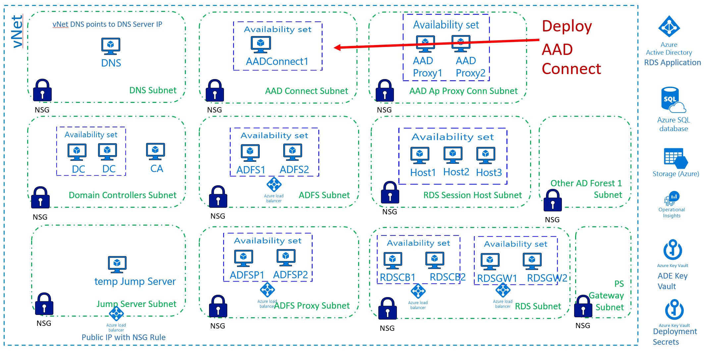

[Back to main page](DeploymentOutline.md)
# Deploy AAD Connect

deployment template to be developed

### This deployment will do the following:
- Install 1 Windows 2016 Server VMs, download and install AAD Connect. No configuration of AAD Connect is done.
- VM is domain joined, and considered Tier 0
- VM configured on AADConnect subnet
- It will encrypt VM with ADE
- It will configure VM diagnostics with diagnostics storage account
- It will install Microsoft antivirus extension

[Back to main page](DeploymentOutline.md)