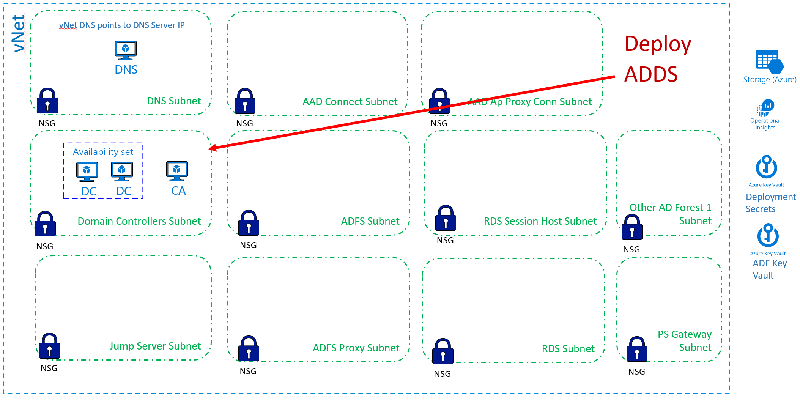

[Back to main page](DeploymentOutline.md)

# Deploy ADDS
Active Directory Domain Services is the core application deployed in this solution. 
It should be deployed and managed in secure way.


Provided template will deploy two domain controllers for specified domain and one enterprise issuing CA:




### Deploy ADDS via ARM template using browser
Use the following link to initiate deployment in your target Tenant/Subscription.
```<language>
https://portal.azure.com/#create/Microsoft.Template/uri/https%3A%2F%2Fraw.githubusercontent.com%2Fdmitriilezine%2FAzurePAW-ADDS%2Fmaster%2FAzurePAW-ADDS%2Fazuredeploy.json
```
:heavy_exclamation_mark: **Parameters** :heavy_exclamation_mark: Most configuration errors come from specifying wrong parameters. 
Pay extra attension to paramter vaules required by the deployment.

### Deploy ADDS via PowerShell
If you are planning to test deployment multiple times and run it against the same deployment or new deployment, 
to save time it is recommended to save your custom parameters to the parameters file. You can do this on the first browser deployment, 
first fill in the values for each required parameter then save the parameter file to your computer. Run the following PowerShell to implement ADDS Domain.

```<language>
$RGName = "ADDS-ResourceGroupName" #must be present. if not create it prior to running this script
$URI = "https://raw.githubusercontent.com/dmitriilezine/AzurePAW-ADDS/master/AzurePAW-ADDS/azuredeploy.json"
$ParFile = "C:\data\ADDS-parametersFile.json"

Login-AzureRmAccount
New-AzureRmResourceGroupDeployment -ResourceGroupName $RGName -TemplateUri $URI -TemplateParameterFile $ParFile

```
### This deployment will do the following:
- Install 2 Windows 2016 Server VM with the ADDS domain. Current deployment supports top level domain name only (ie contoso.com)
- Both VMs configured as DNS servers.
- DIAD ImportExportAD package is applied to ADDS. This creates Tier 0, 1, 2 OUs/GPOs
- Install 1 Windows 2016 Server VM with ADCS role. Enterprise Root Issuing CA. Adds a few custom certificate templates that can be used for certificate enrollment in this environment. 
- All VMs are joined to DomainControllers Subnet
- It will encrypt each VM with ADE
- It will configure each VM diagnostics with diagnostics storage account
- It will install Microsoft antivirus extension in each VM


### Post Deployment Configurations
- Validate via ASC that all VMs are registered with ASC. Validate that they are not showing any red.
- Post configuration of ADDS will be done after JumpServer deployment.


[Back to main page](DeploymentOutline.md)