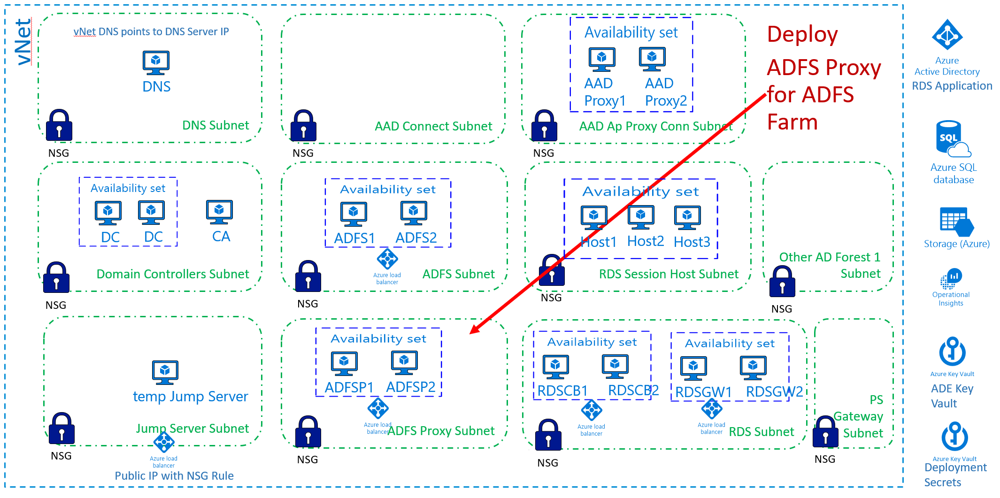

[Back to main page](DeploymentOutline.md)
# Deploy ADFS Proxy (WAP)

deployment template to be developed

### This deployment will do the following:
- Install 2 Windows 2016 Server VMs and configure them as ADFS Proxy servers against existing ADFS farm.
- Both VMs are workgroup joined 
- Both VMs configured on ADFSProxy subnet
- Create ILB in front of ADFS Proxy farm
- It will encrypt each VM with ADE
- It will configure each VM diagnostics with diagnostics storage account
- It will install Microsoft antivirus extension in each VM

[Back to main page](DeploymentOutline.md)