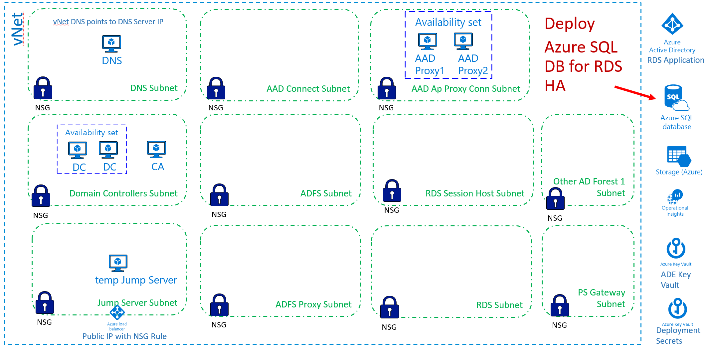

[Back to main page](DeploymentOutline.md)

# Deploy Azure SQL DB
Azure SQL DB will be used to provide HA to the RDS Connection Broker.

Provided template will deploy Azure SQL server and SQL DB:



### Deploy Azure SQL DB via ARM template using browser
Use the following link to initiate deployment in your target Tenant/Subscription.
```<language>
https://portal.azure.com/#create/Microsoft.Template/uri/https%3A%2F%2Fraw.githubusercontent.com%2Fdmitriilezine%2FAzurePAW-AzureSQLdb%2Fmaster%2FAzurePAW-AzureSQLdb%2Fazuredeploy.json
```
:heavy_exclamation_mark: **Parameters** :heavy_exclamation_mark: Most configuration errors come from specifying wrong parameters. 
Pay extra attention to parameter values required by the deployment.

### Deploy Azure SQL DB via PowerShell
If you are planning to test deployment multiple times and run it against the same deployment or new deployment, 
to save time it is recommended to save your custom parameters to the parameters file. You can do this on the first browser deployment, 
first fill in the values for each required parameter then save the parameter file to your computer. Run the following PowerShell to implement Azure SQL DB.

```<language>
$RGName = "ADDProxy-ResourceGroupName" #must be present. if not create it prior to running this script
$URI = "https://raw.githubusercontent.com/dmitriilezine/AzurePAW-AzureSQLdb/master/AzurePAW-AzureSQLdb/azuredeploy.json"
$ParFile = "C:\data\ADDProxy-parametersFile.json"

Login-AzureRmAccount
New-AzureRmResourceGroupDeployment -ResourceGroupName $RGName -TemplateUri $URI -TemplateParameterFile $ParFile

```
### This deployment will do the following:
- Create Azure SQL server and Azure SQL DB on the SQL server


### Post Deployment Configurations
- Validate via ASC that all VMs are registered with ASC. Validate that they are not showing any red.
- any addtional Azure SQL configuration is TBD


[Back to main page](DeploymentOutline.md)