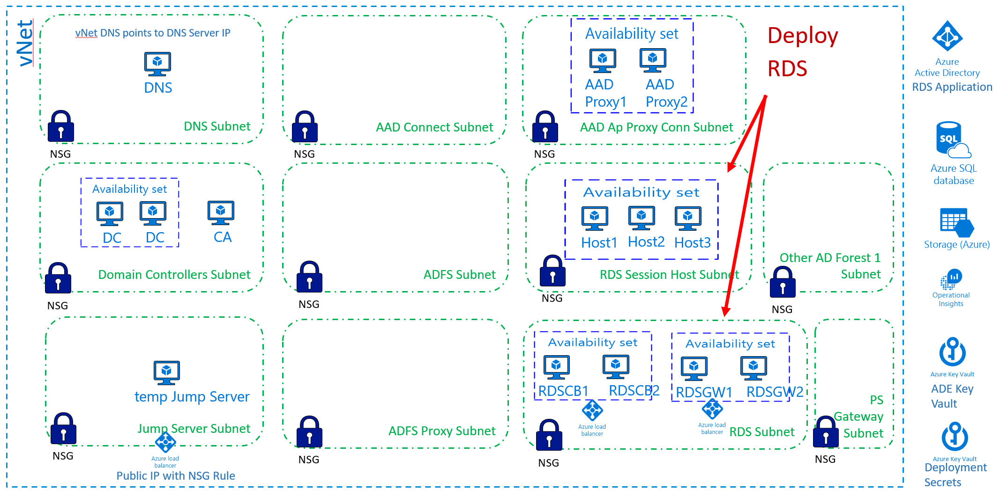

[Back to main page](DeploymentOutline.md)


# Deploy RDS
RDS is used to securely access Tier 0 of the deployed solution. 

Provided template will deploy RDS servers and load balancers:



### Deploy RDS via ARM template using browser
Use the following link to initiate deployment in your target Tenant/Subscription.
```<language>
https://portal.azure.com/#create/Microsoft.Template/uri/https%3A%2F%2Fraw.githubusercontent.com%2Fdmitriilezine%2FAzurePAW-RDS%2Fmaster%2FAzurePAW-RDS%2Fazuredeploy.json
```
:heavy_exclamation_mark: **Parameters** :heavy_exclamation_mark: Most configuration errors come from specifying wrong parameters. 
Pay extra attension to paramter vaules required by the deployment.

### Deploy RDS via PowerShell
If you are planning to test deployment multiple times and run it against the same deployment or new deployment, 
to save time it is recommended to save your custom parameters to the parameters file. You can do this on the first browser deployment, 
first fill in the values for each required parameter then save the parameter file to your computer. Run the following PowerShell to implement RDS.

```<language>
$RGName = "RDS-ResourceGroupName" #must be present. if not create it prior to running this script
$URI = "https://raw.githubusercontent.com/dmitriilezine/AzurePAW-RDS/master/AzurePAW-RDS/azuredeploy.json"
$ParFile = "C:\data\RDS-parametersFile.json"

Login-AzureRmAccount
New-AzureRmResourceGroupDeployment -ResourceGroupName $RGName -TemplateUri $URI -TemplateParameterFile $ParFile

```
### This deployment will do the following:
- Install 7 Windows 2016 Server VMs
- 1 VM will be configured as RDS Connection Broker & Licensing Server
- 1 VM will be configured as RDS Gateway & Web Access
- 1 VM will be configured as RDS Session Host
- Additonal 4 VMs will need to manually added to RDS configuration post deployment
- VMs for CB and GW (4 VMs) are placed on the RDS subnet
- VMs for Session Hosts (3 VMs) are placed on the RDSSessionHosts subnet
- VMs for Session Hosts (3 VMs) configured with RSAT tools to manage ADDS - need to identify any other required tools to be installed
- Install SQL client driver v13 on CB1 and CB2 VMs
- Create ILB in front of RDS CB
- Create ILB in front of RDS Gateway and Web
- DNS records created pointing RDS and Gateway to respective IP addresses for each ILB
- Download provided PFX certifcates to Connection Broker for postdeployment configuration
- All VMs are domain joined, and considered Tier 0
- It will encrypt each VM with ADE
- It will configure each VM diagnostics with diagnostics storage account
- It will install Microsoft antivirus extension in each VM


### Post Deployment Configurations
- Validate via ASC that all VMs are registered with ASC. Validate that they are not showing any red.
- Steps to finish configuration of RDS:
  - Power up JumpServer and validate that source IP in JumpServer NSG is the external IP of your admin device
  - RDP into JumpServer from your admin device
  - RDP into RDS Connection Broker VM1. Perform all RDS configuration on RDS CB VM1:
    - Activate the RD License Server and add it to the License Servers group:
      - In Server Manager, click Tools > Terminal Services > Remote Desktop Licensing Manager. 
      - In RD Licensing Manager, select the server, and then click Action > Activate Server. 
      - Accept the default values in the Activate Server Wizard accepting defaults until you reach the Company information page. Then, enter your company information. 
      - Accept the defaults for the remaining pages until the final page. Clear Start Install Licenses Wizard now, and then click Finish. 
      - Click Action > Review Configuration > Add to Group > OK. Enter credentials for a user in the AAD DC Administrators group, and register as SCP. This step might not work if you are using Azure AD Domain Services, but you can ignore any warnings or errors. 
    - In Server manager add all RDS VMs (CB1, CB2, GW1, GW2, Host1, Host2, Host3)
    - Expand RDS configuration - it should identify CB1 as Connection Broker/License Server, GW1 as Gateway and Web Access, and Host1 as Session Host
    - Add GW2 VM to both Gateway and Web Access roles
    - Add Host2 and Host3 VMs as sessions hosts to the AdminHost collection.
    - Assign certificates. Certficaites were provided as part of deployment and you will find them on the C:\TempPFX folder. 
    Assign gateway.domain.com cert to Gateway and Web Access roles, and rds.domain.com to CB and Publishing roles.
    - In AdminHost collection, remove domainusers and add appropriate T0 groups as able to authN.
    - In AdminHost collection, modify client settings (drivers, Smart card, Clip etc) as decided by design.
    - In Deployment Properties, RD Gateway properties, under Server Name field, replace with the external URL from the Azure AD App Proxy 
    application that was configured in prior deployment (it will be somthing like rds-tenantname.msappproxy.net or your custom DNS name for it)
    - Open PowerShell and run the following command, which will configure SSO between Gateway and Web Access for the Azure AD Ap Proxy application

```<language>
$yourcollectionname = "AdminHost" #collection name
$proxyfrontendurl = "https://rds-tenantname.msappproxy.net/" #replace with your external URL for the app
Set-RDSessionCollectionConfiguration -CollectionName $yourcollectionname -CustomRdpProperty "pre-authentication server address:s:$proxyfrontendurl`nrequire pre-authentication:i:1"
```

  - Test Connection to RDS from the client device:
    - On the admin device, open IE and go to the external URL, ie https://rds-tenantname.msappproxy.net/rdewb (or your custom domain)
    - Authenticate with Azure AD account
    - You should now see RDS Web form for authentication
    - Provide ADDS credential that have been authorized to use RDS, you should be authenticated into one of the Session Hosts
  - Configure HA for Connection Broker
    - Add High Availability to the CB, speficy ODBC connection string from the Azure SQL DB (which was deployed in one of the prior deployments)
    - Update RDS certificate so it is instaled on the second CB VM


References: 
-   https://docs.microsoft.com/en-us/azure/active-directory/manage-apps/application-proxy-integrate-with-remote-desktop-services
-   https://docs.microsoft.com/en-us/windows-server/remote/remote-desktop-services/rds-deploy-infrastructure
-   https://docs.microsoft.com/en-us/windows-server/remote/remote-desktop-services/rds-connection-broker-cluster
-   https://docs.microsoft.com/en-us/windows-server/remote/remote-desktop-services/rds-rdweb-gateway-ha

[Back to main page](DeploymentOutline.md)


