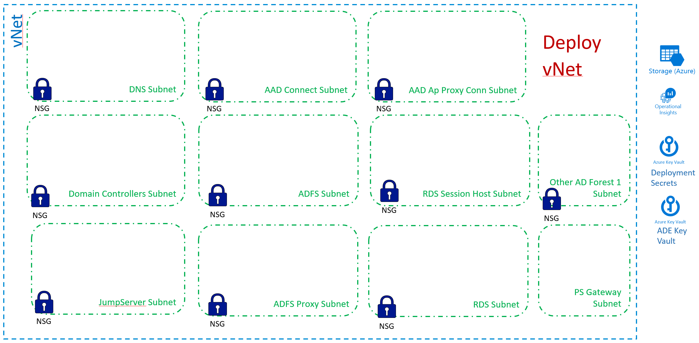

[Back to main page](DeploymentOutline.md)

# Deploy vNet

##### Why required: vNet will host VMs and provide network connectivity to other environments.

Properly designed and implemented network is the baseline foundation to secure implementation. 
The following template provides an example of vNet implementation for this solution. It might need to be modified 
to accommodate specific requirements of your customer test/pre-prod/prod network environment.

The main goal behind this design is to provide micro-segmentation between different solution components.
This is done by creating multiple subnets with dedicated Network Security Groups (NSGs). NSGs configured to control 
type of traffic is allowed into each subnet. You can examine NSG rules in the template and adjust them as needed.


Provided template will deploy the following network configuration:




> Deployment consideration - block all incoming traffic from other customer environments (only allow inter-subnet) 
till ADDS/RDS is fully configured. Then unblock it to allow communication with existing infrastructure. This is to 
prevent any potential attack on the environment from internal customer network (assuming compromise) while it is 
being configured and hardened. NSG rules in the template would need to be modified to accommodate this deployment consideration.

### Deploy vNet via ARM template using browser
Use the following link to initiate vNet deployment in your target Tenant/Subscription.
```<language>
https://portal.azure.com/#create/Microsoft.Template/uri/https%3A%2F%2Fraw.githubusercontent.com%2Fdmitriilezine%2FAzurePAW-vNet11%2Fmaster%2FAzurePAW-vNet11%2Fazuredeploy.json 
```

### Deploy via PowerShell
If you are planning to test deployment multiple times and run it against the same deployment or new deployment, 
to save time it is recommended to save your custom parameters to the parameters file. You can do this on the first browser deployment, 
first fill in the values for each required parameter then save the parameter file to your computer. Run the following PowerShell to implement vNet.

```<language>
$RGName = "vNetResourceGroupName" #must be present. if not create it prior to running this script
$URI = "https://raw.githubusercontent.com/dmitriilezine/AzurePAW-vNet11/master/AzurePAW-vNet11/azuredeploy.json"
$ParFile = "C:\data\vNet-parametersFile.json"

Login-AzureRmAccount
New-AzureRmResourceGroupDeployment -ResourceGroupName $RGName -TemplateUri $URI -TemplateParameterFile $ParFile

```
:heavy_exclamation_mark: **Parameters** :heavy_exclamation_mark: Most configuration errors come from specifying wrong parameters. 
Pay extra attention to parameter values required by the deployment.

### This deployment will do the following:
1. Create vNet
2. Create 10 NSGs
3. Create 11 subnets and assigns appropriate NSG to target subnet
4. Assign IP address for DNS server (to be deployed in later steps)


### Post Deployment Configurations
#### RBAC
- If administrator(s) who will be creating VMs are different from the administrators who will control network, then need to grant them with ability to join VMs to the existing network. 
- Create custom RBAC role with network join capability. Assign this RBAC role over Network RG to the administrators of VMs that will be created in this solution.

#### Diagnostics logging and network watcher configuration
It is important to log diagnostics and network flow data for each NSG. 
You can use the following PowerShell script to configure it. Run it from the CloudShell targeting individually each NSG. 


```<language>
# Configure NSG with diagnostics and network watcher
# Update parameters to match your design

$NSGName = "NSG-Name"
$NSGrg = "NSG-RG"
$LogAnalyticsName = "ASC-LogAnalytics-Workspace"
$LogAnalyticsRG = "ASC-LogAnalytics-Workspace-RG"
$StorageAccountName = "xxxxxnetworkxxxxx" #Name of the Storage account for network diagnostics. It was created in prior deployment step. 
$StorageAccountRG = "storageaccountRG"
$RetentionDays = "90" #update with desired interval

# update this with the region where Network Watcher is enabled in your subscription.
$NetworkWatcherRegion = "NetworkWatcher_southcentralus"

$Nsg=Get-AzureRmNetworkSecurityGroup -Name $NSGName -ResourceGroupName $NSGrg
$Oms=Get-AzureRmOperationalInsightsWorkspace -ResourceGroupName $LogAnalyticsRG -Name $LogAnalyticsName
$sa=Get-AzureRmStorageAccount -ResourceGroupName $StorageAccountRG -AccountName $StorageAccountName

$NW = Get-AzurermNetworkWatcher -ResourceGroupName NetworkWatcherRg -Name $NetworkWatcherRegion

Set-AzureRmDiagnosticSetting -ResourceId $Nsg.Id -WorkspaceId $Oms.ResourceId -StorageAccountId $sa.Id `
-Enabled $true `
-RetentionEnabled $true `
-RetentionInDays $RetentionDays
Set-AzureRmNetworkWatcherConfigFlowLog -NetworkWatcher $NW -TargetResourceId $nsg.Id -StorageAccountId $sa.Id `
-EnableFlowLog $true `
-EnableTrafficAnalytics `
-Workspace $oms `
-EnableRetention $true `
-RetentionInDays $RetentionDays
```

#####
#### Egress traffic configuration
Have to be discussed and worked out based on the specific customer situation. One or combination of the following:
- Configure egress traffic to work with existing NVAs - configure UDRs for each subnet to point 0.0.0.0/0 to NVA.
- If no NVAs, then configure egress traffic via NSGs.
- If traffic is going via ExpressRoute, then configure UDRs to point to the route via on-premises network.


**Note:** This template does not use DSC or Script extensions.

[Back to main page](DeploymentOutline.md)