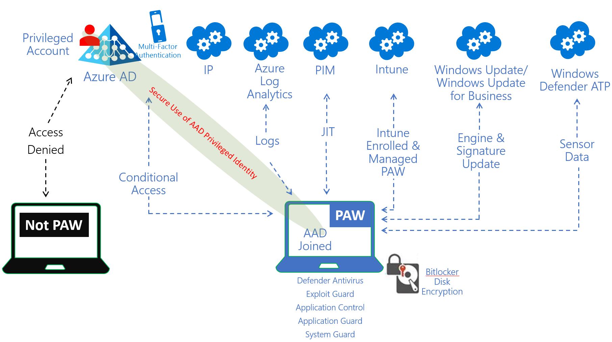
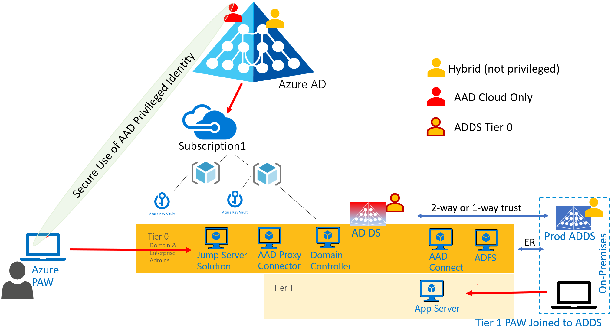
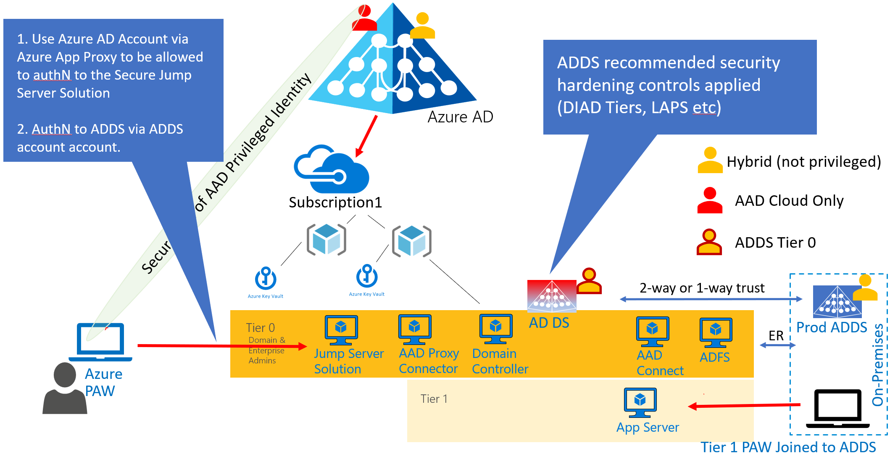
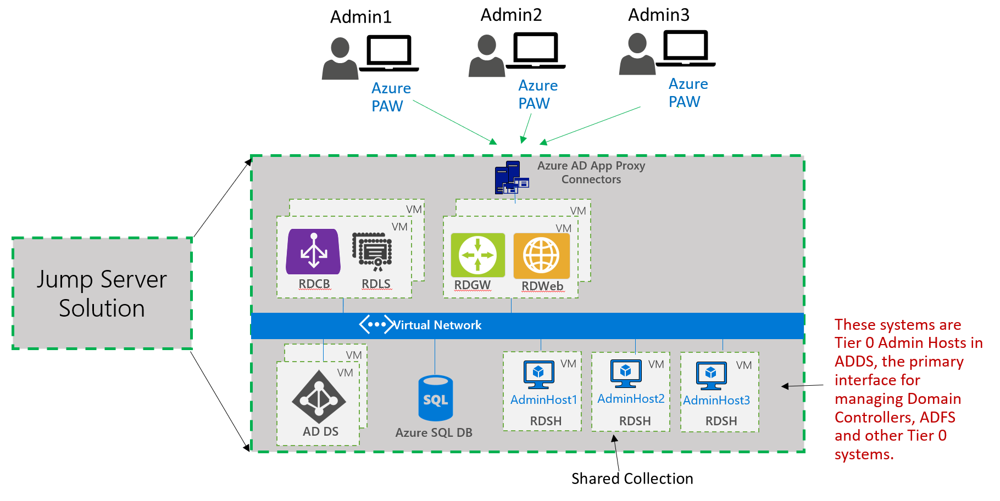
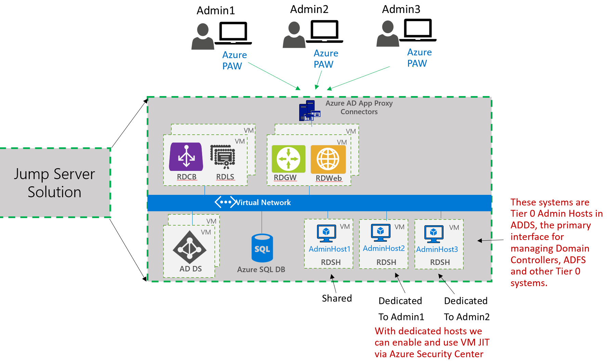

[Back to Title Page](README.md)
# Solution Overview
 
## Azure Privileged Access Workstation (Azure PAW)
Any application deployed in Azure AD or in associated subscriptions is under control of Azure AD credentials with privileged access.
It is very critical to provide security for these credentials to ensure that Azure Control Plane is not subject to malicious use by 
attackers who were able to compromise Azure AD credentials.
Combining Azure provided security controls (like MFA, PIM, Identity Protections etc) with properly designed and 
implemented Azure Privileged Access Workstation (Azure PAW) provides the highest level of credential 
theft mitigation against Azure AD privileged accounts.

Azure PAW is deployed and managed via Azure based controls. It has no dependencies on any on-premises infrastructure. 
Azure PAW follows Zero Trust Networks principals, which rely on using cloud provided controls to provide operational security
to end user devices. 

The following is the logical design for Azure PAW:

1. It is deployed via Intune Autopilot with Intune configuration and policies applied to it from the initial configuration of the device.
2. Intune will configure and manage Windows 10 1809 native security features (like what software is allowed to run, what websites are trusted 
and should not be redirected into application guard, use of USB ports, antivirus, Windows Defender ATP and many other)
3. Intune together with Azure AD Conditional Access will make a decision if user is allowed to authenticate to Azure control plane
or specific target Azure AD application from the user device. If device is deemed to be not compliant with specified policies then user 
will be denied access to Azure control plane or target application.

By using Azure PAW for all critical Azure AD privileged identities, we can provide higher security posture for management of Azure Virtual Datacenter.

The design of the controls and deployment for Azure PAW is being done in parallel and is not documented here.

## Managing applications in Azure Virtual Datacenter

Most customers deploy a combination of SaaS, PaaS and IaaS applications in Azure. SaaS and PaaS applications usually do not 
require OS level management, as they are natively integrated into Azure and managed via provided by Azure controls, specific 
to that application. Administration of SaaS and PaaS is usually done via Azure AD accounts with proper application RBAC assigned to them.
Azure PAW in combination with DevOps can be used to provide secure administration of such applications.

It is not the same for the majority of IaaS based workloads, as they require deployment of traditional servers, running Windows or Linux
operating systems. Almost every customer has deployed, deploying or planning to deploy Active Directory into their Azure IaaS environment.

Secure management of IaaS requires secure deployment of the applications and then secure access at operating system level, which 
in most cases uses OS level credentials, like Active Directory accounts. These accounts are subject to theft and malicious use by the 
bad actors.

#### Goal Behind Secure Management of Azure Virtual Datacenter solution
- The goal behind this solution is to provide secure implementation and management of Active Directory in Azure Virtual Datacenter.
- It relies on the Azure PAW to provide secure control over the Azure control plane, thus ensuring that IaaS resources are not compromised via Azure AD credentials
- It relies on the Azure PAW to provide secure access to the target applications at OS level, specifically for Tier 0 access to ADDS and Tier 0 applications
- It is designed with Zero Trust Networks principals, using Azure AD Identity as a security perimeter
- It is designed to be independent from existing on-premises infrastructure. 
- It is designed with granular deployment approach, to allow plug-in implementation of additional critical applications, like ADFS, AADCoonnect or other applications. 

The following diagrams show logical view

Administrator uses Azure PAW to authenticate to Azure AD. Administrator access to ADDS Tier 0 via Azure AD published
application for secure jump server solution. 

Secure jump server solution currently based on the Windows 2016 Remote Desktop Services (RDS). The following diagram shows design 
for RDS as it is implemented in this solution. 
> [Azure Windows Virtual Desktop](https://azure.microsoft.com/en-us/services/virtual-desktop/) will need to be evaluated in the coming months to see if it can replace RDS. It should GA sometime in CY19

> **Note on Point-to-Site VPN use:** 
> - [Always On VPN supports Azure AD Conditional Access](https://docs.microsoft.com/en-us/windows-server/remote/remote-access/vpn/ad-ca-vpn-connectivity-windows10), but it is [not supported for installation in Azure](https://docs.microsoft.com/en-us/windows-server/remote/remote-access/vpn/always-on-vpn/deploy/always-on-vpn-deploy), 
> so not a choice to provide access to Azure without dependency on on-premises environment.
> - [Azure native Point-to-Site VPN](https://docs.microsoft.com/en-us/azure/vpn-gateway/vpn-gateway-howto-point-to-site-resource-manager-portal) does not support authentication via AAD Identity and use of AAD Conditional Access. It requires client certificates to be installed on the Azure PAW and requires installation of the VPN client. 
> While use of native Point-to-Site VPN can be combined with use of Azure Security Center VM Just-in-Time access, which would requrie to pass through AAD Conditional Access for user to activate it, 
> the requirement to have client certificate and installation of the VPN profile on the Azure PAW makes this option not feasible choice to provide enterprise Tier 0 level access to resources in Azure Virtual Datacenter.
>
> - [Azure RADIUS Point-to-Site VPN](https://docs.microsoft.com/en-us/azure/vpn-gateway/point-to-site-how-to-radius-ps) does not support 
> authentication via AAD Identity and use of AAD Conditional Access. This option supports authentication via certificate or userID/password (ADDS or other directory). 
> It can also be [integrated with Azure MFA](https://docs.microsoft.com/en-us/azure/active-directory/authentication/howto-mfa-nps-extension#install-the-nps-extension). It requires installation of the VPN profile on the Azure PAW, but does not have dependency on the internal enterprise PKI, if userID/password is used. 
> It also can be used with Azure Security Center VM Just-in-Time access.
> > - RADIUS Point-to-Site VPN should be considered as another potential option to provide Tier 0 level of access to the IaaS of Azure Virtual Datacenter. 
> > It has to be evaluated on what needs to be done and all of the dependencies and requirements for such deployment to support stated requirements of solution 
> > to have no dependencies on the on-premises environment, use of Azure AD joined PAW (no SSO from it to the ADDS Tier 0 - 
> > no easy way to use RSAT tools to manage Tier 0) and use Azure AD identities as the security perimeter.
> > - Currently, this solution does not provide deployment option of RADIUS Point-to-Site VPN.

RDS based access via Azure AD App Proxy supports stated requirements. It supports use of Azure AD identity as security perimeter, 
it provides secure access to the Tier 0 in the target environment and allows use of the common RSAT tools to manage it.
RDS solution is joined to the Active Directory and implemented in high availability configuration. 
Current design is using shared collection for session hosts, which will act the the primary interface to manage Tier 0.

According to RDS documentation it is possible to use dedicated Hosts for each Admin. 
This would need to be tested... Use of dedicated session hosts for specific Tier 0 admins would provide tigher access control
and audit history. Also, with dedicated session hosts it will be possible to provide targeted Azure Security Center VM Just-in-Time access to the Tier 0 servers.

#### Implementing Secure Management of Azure Virtual Datacenter solution
Implementation of the solution is designed to be "infrastructure as a code" as much as possible. 
Azure resource manager templates with Desired State Configuration and custom script extensions are used for majority of the 
deployments. Manual steps are eliminated whenever possible. By doing automated deployments, it provides consistent and 
predictable deployment results.

[**Secure Deployment and Management of ADDS in Azure IaaS - Implementation Steps**](DeploymentOutline.md) shows
 how to deploy this solution into your Azure Virtual Datacenter.

[Back to Title Page](README.md)